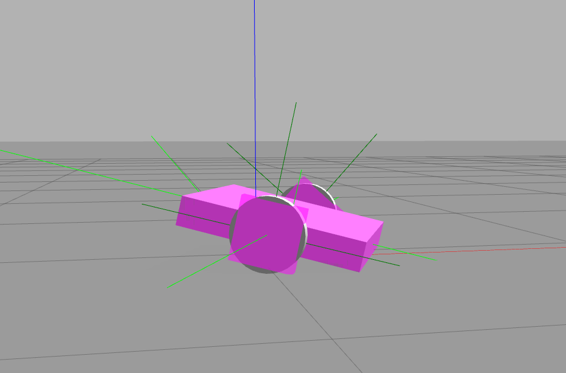
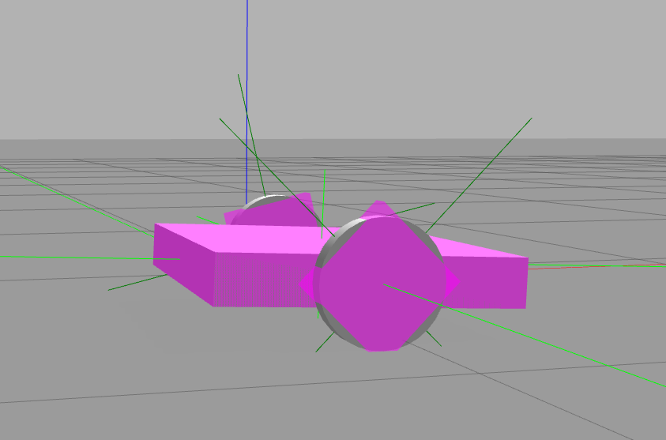
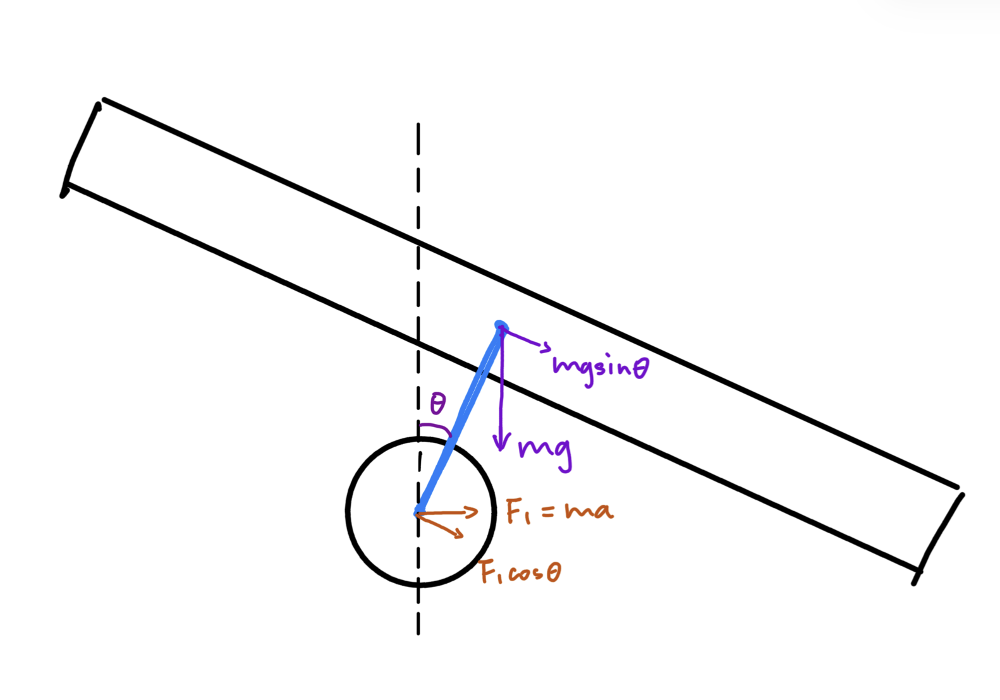
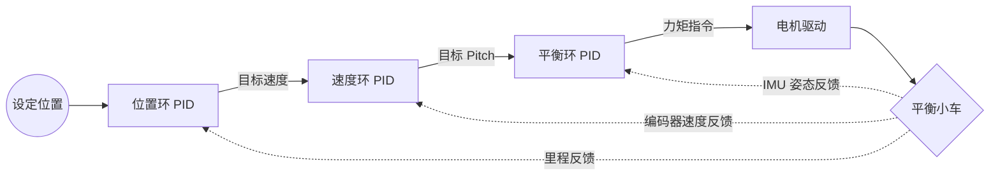
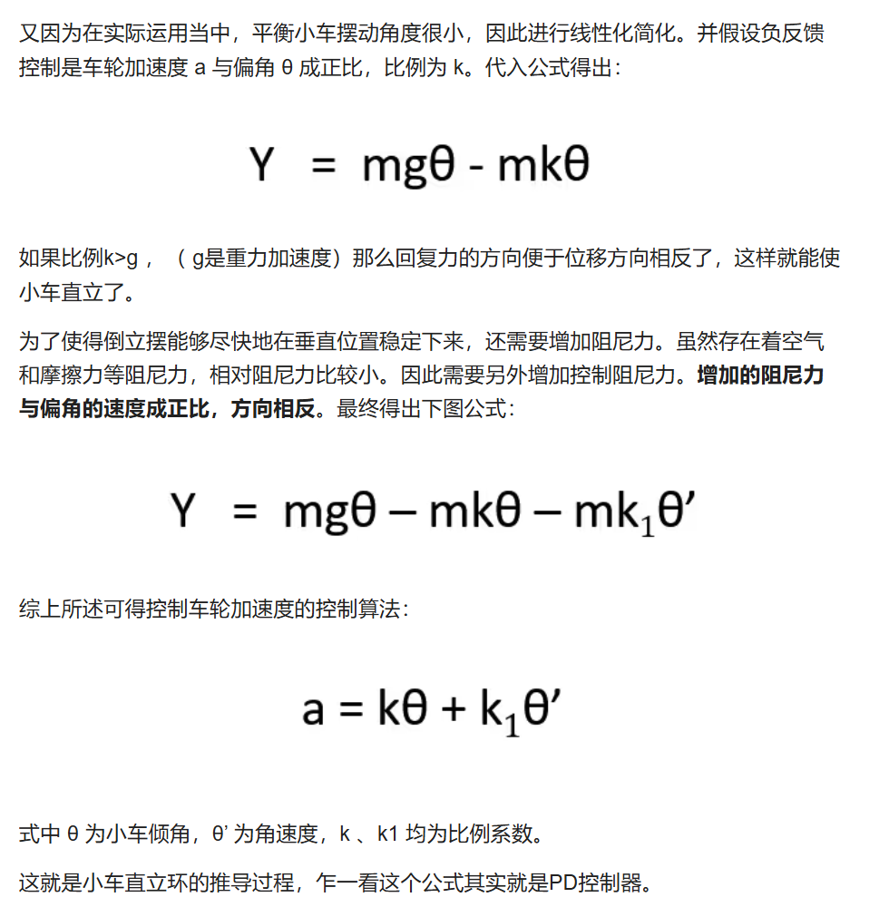

# 整体情况

| 功能             | 完成情况 | 说明 |
| ---------------- | -------- | ---- |
| 平衡小车URDF     |  已完成  | 在之前差速小车URDF基础上修改得来，调整了质量和对应的惯性矩阵 |
| 平衡小车关节驱动 |   已完成   | 通过给两边轮子加载力矩控制器实现 |
| 为平衡小车添加IMU  |  已完成  | 通过Gazebo传感器插件添加了 IMU |
| ...              | ...      | ...  |

## 功能细节

### 平衡小车URDF


如图所示，给平衡小车URDF设置了合适的惯性矩阵。

**遇到的问题** 由于当前车体质量分布情况，以及gazebo环境较理想，导致即使不加载控制器，小车也不会跌倒。

**我的解决方法** 通过加载时添加初始姿态参数，使小车一开始就处于倾斜状态。实践中，在让轮子转动后再停止，小车会进入倾倒状态。
```xml
  <node name="urdf_spawner" pkg="gazebo_ros" type="spawn_model" respawn="false" output="screen"
        args="-urdf -model balance_car -param robot_description -x 0 -y 0 -z 0.2 -P 0.1" />
```

> **注意！** 此处的小车urdf结构上存在问题无法控制平衡，具体来说**轮子的转轴不应与小车重心在同一水平线上**，而应比车体重心更低。后续会在控制器章节中进一步说明。


### 平衡小车关节驱动



这是一张运动中的截图。可从图中轮子坐标轴看出，轮子能够转动。

实现方式是通过给左右轮子分别加载力矩控制器，然后发布力矩指令即可。

**遇到的问题** 一开始发布力矩指令后，小车开始高速旋转，难以控制。

**我的解决方法** ：
- 首先认为是车身质量设置过低导致，调整质量并同步让ai生成惯性矩阵，问题仍存在。
- 后来发现是没有设置动力学参数，给轮子添加了适当的粘性阻尼和静摩擦力后，问题解决。
```xml
<dynamics damping="0.1" friction="0.1"/>
```

---

### 为平衡小车添加IMU

通过以下代码段添加了 imu 模块
```xml
    <gazebo reference="imu_link">
      <gravity>true</gravity>
      <sensor name="imu_sensor" type="imu">
        <always_on>true</always_on>
        <update_rate>100</update_rate>
        <visualize>true</visualize>
        <imu/>
        <plugin filename="libgazebo_ros_imu_sensor.so" name="imu_plugin">
          <topicName>imu</topicName>
          <bodyName>imu_link</bodyName>
          <updateRateHZ>100.0</updateRateHZ>
          <gaussianNoise>0.0</gaussianNoise>
          <xyzOffset>0 0 0</xyzOffset>
          <rpyOffset>0 0 0</rpyOffset>
          <frameName>imu_link</frameName>
          <initialOrientationAsReference>false</initialOrientationAsReference>
        </plugin>
      </sensor>
    </gazebo>
```

### 搭建平衡小车控制器

### 使用PID控制
**问题**：为了使小车实现平衡和其他的运动需求，我们需要控制哪些*状态*？

**我的理解**：需要控制小车 pitch 

参考文章：[平衡小车控制原理（受力分析及公式推导）](https://www.bilibili.com/read/cv7875274/?opus_fallback=1)

根据本文章我建立了对平衡小车控制的基本认知：**平衡就是控制 pitch 不变**
小车倾倒时 pitch 会增大，这是我们不希望看到的。只需要 pitch 固定在一个值，我们就可以认为小车是平衡的。


如上图所示，当平衡小车倾斜 $\theta$ 角时，重力产生偏离力矩 $M = L \cdot mg\sin\theta$。
为抵消此力矩，需控制轮子加速产生惯性力，形成反向平衡力矩 $M_1 = L_1 \cdot ma\cos\theta$。
由于 $L = L_1$，达到平衡的条件即为：$mg\sin\theta = ma\cos\theta$。

当 $\theta = 0$ 时，$M = 0$，处于静止或匀速运动的平衡态。

> 上面我们提到的小车urdf结构上存在问题: 若轮子转轴与重心重合，则 $L_1 = 0$ 导致 $M_1 \equiv 0$，轮子加速无法产生回复力矩。因此，**轮子转轴必须低于车体重心**。

现在回顾小车的运动需求：
- **小车能够自起**（指小车从到在地上到平衡的状态）：将小车从倾倒状态（支持力矩平衡）变为由轮子加速度维持的动态平衡状态。
- **小车能够前后移动**：上面的推导中可以发现，若小车前倾，维持平衡需要轮子向前加速以产生反向力矩 $M_1$，这时小车整体会向前移动；反之亦然。所以我们可以通过主动打破 $\theta = 0$ 的平衡状态，使重心前偏移或后偏产生受力，进而**为维持小车 pitch 不变**，轮子就会加速驱动小车运行。

由此我们可以确立pid控制的思路：
1. 通过一个平衡环控制 $\theta$ 角，即 pitch 角，使其维持在目标 pitch 以确保平衡。
2. 通过一个速度环控制小车的目标 pitch，使小车能够前后移动。

以上两个环基本实现了前后移动和平衡、自起的运动目标，但对于小车能够在一定距离内稳定的要求，还需要增加一个位置环。综上可以得到以下的串级控制结构：



**遇到的问题**：即使添加了位置环，小车仍然无法稳定在一个位置，会缓慢来回移动。
**我的解决方法**：首先我尝试调节PID参数，尝试了将error发话题用plotjuggler看曲线的调试思路，但效果不明显。后面根据参考文章修改了控制公式，添加了*控制阻尼力*：


代码实现为：
```cpp
  //....
  current_pitch_ = pitch;
  current_pitch_dot_ = msg->angular_velocity.y; // 获取 IMU 提供的角速度作为微分项
  //....
  double pitch_error = current_pitch_ - target_pitch_;
  double base_effort = balance_pid_.computeCommand(pitch_error, current_pitch_dot_, period);
```